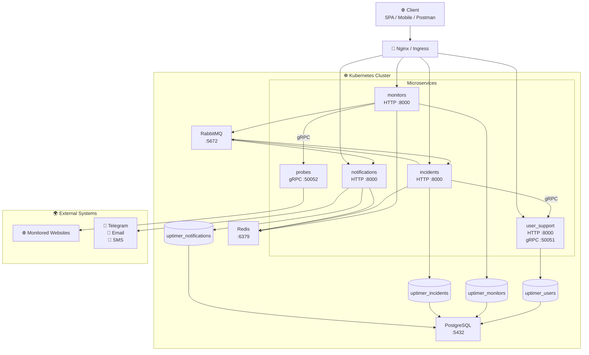

# UptimeMonitor

**UptimeMonitor** — асинхронная микросервисная платформа для непрерывного мониторинга доступности веб-ресурсов (HTTP/HTTPS) с автоматической регистрацией инцидентов и мгновенным уведомлением пользователей через Telegram, Email и SMS.

---

##  Технологический стек

* **Language:** Python 3.13
* **Frameworks & Core:** Django, Django REST Framework, gRPC (Protobuf)
* **Dependency Management:** Poetry
* **Async & Task Management:** Celery, Celery Beat
* **Message Broker:** RabbitMQ
* **Databases & Cache:** PostgreSQL, Redis
* **Auth:** JWT (JSON Web Tokens), OAuth 
* **Observability & Logging:** Prometheus, Grafana, Grafana Loki, Promtail
* **Reverse Proxy:** Nginx
* **DevOps & Containerization:** Docker, Docker Compose, Kubernetes 

---

## Архитектура и микросервисы

Проект построен по принципам событийно-ориентированной микросервисной архитектуры (EDA) с полным разделением баз данных (**Database per Service**).

```mermaid
graph TD
    classDef clientStyle fill:#0d0e12,stroke:#4a5568,stroke-width:2px,color:#f8fafc;
    classDef serviceStyle fill:#16192b,stroke:#3b82f6,stroke-width:2px,color:#f8fafc;
    classDef probeStyle fill:#064e3b,stroke:#10b981,stroke-width:2px,color:#f8fafc;
    classDef dbStyle fill:#0f172a,stroke:#0ea5e9,stroke-width:2px,color:#f8fafc;
    classDef brokerStyle fill:#1e1029,stroke:#a855f7,stroke-width:2px,color:#f8fafc;
    classDef obsStyle fill:#2e1065,stroke:#8b5cf6,stroke-width:2px,color:#f8fafc;

    subgraph ClientLayer ["Client / External API"]
        Client["SPA / Mobile / Postman<br/>(JWT Authentication / OAuth)"]:::clientStyle
    end

    subgraph Microservices ["Microservices Layer"]
        subgraph UserSupportGroup ["user_support"]
            US_WEB["user_support_web<br/>:8001 (Auth & Users)"]:::serviceStyle
            US_GRPC["user_support_grpc<br/>:50051 (gRPC Server)"]:::serviceStyle
        end

        subgraph MonitorsGroup ["monitors"]
            M_WEB["monitors_web<br/>:8002 (CRUD Monitors)"]:::serviceStyle
            M_BEAT["monitors_beat<br/>(Periodic Schedule)"]:::serviceStyle
            M_WORKER["monitors_worker<br/>(Check Orchestrator)"]:::serviceStyle
        end

        subgraph ProbesGroup ["probes"]
            P_GRPC["probes_grpc<br/>:50052 (Async gRPC Agent)"]:::probeStyle
        end

        subgraph IncidentsGroup ["incidents"]
            INC_WEB["incidents_web<br/>:8003 (Incidents API)"]:::serviceStyle
            INC_WORKER["incidents_worker<br/>(Incident Consumer)"]:::serviceStyle
        end

        subgraph NotificationsGroup ["notifications"]
            NOTIF_WEB["notifications_web<br/>:8004 (History API)"]:::serviceStyle
            NOTIF_WORKER["notifications_worker<br/>(Email/TG/SMS Sender)"]:::serviceStyle
        end
    end

    subgraph ObservabilityLayer ["Observability & Monitoring"]
        Prometheus[("Prometheus<br/>:9090 (Metrics Scraper)")]:::obsStyle
        Promtail["Promtail<br/>(Docker Log Collector)"]:::obsStyle
        Loki[("Grafana Loki<br/>:3100 (Log Aggregator)")]:::obsStyle
        Grafana["Grafana<br/>:3000 (Dashboards & Visuals)"]:::obsStyle
    end

    subgraph EventBackbone ["Message Broker & Cache"]
        RabbitMQ[("RabbitMQ<br/>:5672 / :15672<br/>(Exchanges & Queues)")]:::brokerStyle
        Redis[("Redis<br/>:6379<br/>(Celery Backend / Cache)")]:::brokerStyle
    end

    subgraph Persistence ["Persistence Layer (PostgreSQL Container :5432)"]
        DB_USERS[("DB: uptimer_users")]:::dbStyle
        DB_MONITORS[("DB: uptimer_monitors")]:::dbStyle
        DB_INCIDENTS[("DB: uptimer_incidents")]:::dbStyle
        DB_NOTIFICATIONS[("DB: uptimer_notifications")]:::dbStyle
    end

    Client -->|"1. Auth / Login (JWT)"| US_WEB
    Client -->|"2. Create Monitors / Rules"| M_WEB
    Client -->|"View Incidents"| INC_WEB

    US_WEB --- DB_USERS
    US_GRPC --- DB_USERS
    M_WEB --- DB_MONITORS
    M_WORKER --- DB_MONITORS
    INC_WORKER --- DB_INCIDENTS
    INC_WEB --- DB_INCIDENTS
    NOTIF_WORKER --- DB_NOTIFICATIONS
    NOTIF_WEB --- DB_NOTIFICATIONS

    M_BEAT -->|"Trigger Checks"| RabbitMQ
    RabbitMQ -->|"Fetch Task"| M_WORKER

    M_WORKER ==>|"1. Primary: gRPC Check Request"| P_GRPC
    P_GRPC -->|"Execute Async HTTP/HTTPS Check"| TargetSites[("External Web Resources")]:::clientStyle
    P_GRPC ==>|"Return Response Metrics"| M_WORKER
    M_WORKER -. "2. Fallback: Local HTTP Check (If Probes Down)" .-> TargetSites

    M_WORKER -->|"Publish Failure/Recovery Event"| RabbitMQ
    RabbitMQ -->|"incidents_queue"| INC_WORKER
    INC_WORKER -->|"Publish Notification Event"| RabbitMQ
    RabbitMQ -->|"notifications_queue"| NOTIF_WORKER

    INC_WORKER ==>|"gRPC: Get User Contacts<br/>(User Support Proto)"| US_GRPC
    NOTIF_WORKER -->|"Send Alert"| External[("External Providers<br/>Telegram / Email / SMS")]:::clientStyle

    %% Observability Connections
    Prometheus -->|"Scrape /metrics"| US_WEB
    Prometheus -->|"Scrape /metrics"| M_WEB
    Prometheus -->|"Scrape /metrics"| INC_WEB
    Prometheus -->|"Scrape /metrics"| NOTIF_WEB

    Promtail -. "Read stdout/stderr (Docker Socket)" .-> US_WEB
    Promtail -->|"Push Logs"| Loki
    Grafana -->|"Query Metrics"| Prometheus
    Grafana -->|"Query Logs"| Loki
```




### Разделение по сервисам

* **`user_support`**
  * Управление пользователями, аутентификация и авторизация (JWT).
  * Предоставляет **gRPC-сервер** (`grpc_server.py`) для быстрого синхронного получения данных пользователей другими микросервисами без нагрузки на REST API.

* **`monitors`**
  * Настройка таргетов (URL, интервалы проверки, ожидаемые статусы).
  * **Celery Beat** планирует периодические таски, пингует сайты, фиксирует время отклика и отправляет результаты в RabbitMQ.

* **`probes`**
  * Легковесный высокопроизводительный асинхронный gRPC-агент (Python 3.13 + AsyncIO + httpx).
  * Выполняет непосредственные HTTP/HTTPS проверки целевых сайтов, замеряет latency в миллисекундах, проводит валидацию статус-кодов и контента.
  * Может масштабироваться и разворачиваться в разных гео-локациях (с идентификацией через PROBE_ID).

* **`incidents`**
  * Обрабатывает события из RabbitMQ.
  * Фиксирует падения/восстановления сайтов, формирует инциденты и историю даунтайма.
  * При необходимости запрашивает данные владельца через **gRPC Client** в `user_support`.

* **`notifications`**
  * Сервис доставки сообщений (Email, Telegram, SMS).
  * Читает события из `notifications_queue` и отправляет асинхронные уведомления пользователям при смене статуса их сайтов (при первом падении или восстановлении).

---

## Основной бизнес-процесс (Flow данных)

1. **Инициализация:** Celery Beat внутри сервиса `monitors` по расписанию триггерит проверку списка сайтов.
2. **Делегирование проверки (gRPC):** Воркер monitors передает параметры проверки асинхронному сервису probes по gRPC.
3. **Пинг:** Рабочие воркеры совершают HTTP-запросы к целевым ресурсам и фиксируют метрики (`latency`, `status code`, `availability`).
4. **Обработка события:** Результат проверки отправляется в брокер сообщений **RabbitMQ**.
5. **Регистрация инцидента:** Сервис `incidents` вычитывает событие. Если сайт упал (или восстановился после сбоя), создается или закрывается объект инцидента.
6. **gRPC-интеграция:** Сервис `incidents` делает межсервисный gRPC-вызов к `user_support` для получения контактов владельца ресурса.
7. **Уведомление:** Сообщение о сбое или восстановлении отправляется в очередь `notifications`, откуда воркеры нотификаций отправляют сообщения в Telegram / Email / SMS.
8. **Сбор метрик и логов:** Prometheus скрейпит эндпоинты /metrics всех Django-сервисов и агентов. Promtail автоматически перехватывает лог-стримы контейнеров и отправляет в Loki.

---

## 📁 Структура проекта

```text
uptimemonitor/
├── shared/                 # Общие собственные пакеты для всех сервисов
│   └── user_support.proto  # Пакет, содержащий общее логирование и middleware 
├── protos/                 # Общие Protobuf-контракты (.proto) для всех сервисов
│   ├── user_support.proto
│   └── probes.proto
├── user_support/           # Микросервис пользователей & gRPC Server (:50051)
│   ├── config/             # Настройки сервиса
│   ├── proto/              # Сгенерированные gRPC-стабы
│   ├── grpc_server.py      # Точка входа gRPC сервера
│   └── user_support/       # Django app
├── monitors/               # Микросервис управления мониторами & Celery Beat
│   ├── config/             # Настройки сервиса
│   ├── proto/              # Сгенерированные gRPC-стабы (для probes)
│   ├── grpc_client.py      # gRPC-клиент для вызова агентов probes
│   └── monitors/           # Django app & tasks (с поддержкой Fallback)
├── probes/                 # Асинхронный gRPC-агент проверок (:50052)
│   ├── proto/              # Сгенерированные gRPC-стабы
│   ├── src/
│   │   ├── checkers/       # Логика асинхронных HTTP-запросов (httpx)
│   │   └── grpc_service.py # Реализация gRPC Servicer
│   └── grpc_server.py      # Запуск асинхронного gRPC сервера
├── incidents/              # Микросервис регистрации сбоев & gRPC Client
│   ├── config/             # Настройки сервиса
│   ├── proto/              # gRPC-стабы (для user_support)
│   └── incidents/          # Django app & tasks
├── notifications/          # Микросервис отправки сообщений (Email/TG/SMS)
│   ├── config/             # Настройки сервиса
│   └── notifications/      # Django app & tasks
├── init-multiple-dbs.sql   # Скрипт инициализации независимых БД в PostgreSQL
├── docker-compose.yml      # Локальный запуск всего окружения
└── README.md
```

## ☸️ Kubernetes

Проект полностью разворачивается в Kubernetes.

Внутри Kubernetes сервисы общаются через DNS-имена Kubernetes.

Например:

```
postgres:5432
redis:6379
rabbitmq:5672

user-support-grpc:50051
probes-grpc:50052

HTTP-сервисы:
user-support-web:8000
monitors:8000
incidents-web:8000
notifications:8000
```

