# 🚀 UptimeMonitor

**UptimeMonitor** — асинхронная микросервисная платформа для непрерывного мониторинга доступности веб-ресурсов (HTTP/HTTPS) с автоматической регистрацией инцидентов и мгновенным уведомлением пользователей через Telegram, Email и SMS.

---

## 🛠 Технологический стек

* **Language:** Python 3.13
* **Frameworks & Core:** Django, Django REST Framework, gRPC (Protobuf)
* **Dependency Management:** Poetry
* **Async & Task Management:** Celery, Celery Beat
* **Message Broker:** RabbitMQ
* **Databases & Cache:** PostgreSQL (отдельная БД для каждого сервиса), Redis
* **Auth:** JWT (JSON Web Tokens)
* **DevOps & Containerization:** Docker, Docker Compose

---

## 🏗 Архитектура и микросервисы

Проект построен по принципам событийно-ориентированной микросервисной архитектуры (EDA) с полным разделением баз данных (**Database per Service**).

[](docs/uptimer_service_graphic.svg)


### Разделение по сервисам

* **`user_support`**
  * Управление пользователями, аутентификация и авторизация (JWT).
  * Предоставляет **gRPC-сервер** (`grpc_server.py`) для быстрого синхронного получения данных пользователей другими микросервисами без нагрузки на REST API.

* **`monitors`**
  * Настройка таргетов (URL, интервалы проверки, ожидаемые статусы).
  * **Celery Beat** планирует периодические таски, пингует сайты, фиксирует время отклика и отправляет результаты в RabbitMQ.

* **`incidents`**
  * Обрабатывает события из RabbitMQ.
  * Фиксирует падения/восстановления сайтов, формирует инциденты и историю даунтайма.
  * При необходимости запрашивает данные владельца через **gRPC Client** в `user_support`.

* **`notifications`**
  * Сервис доставки сообщений (Email, Telegram, SMS).
  * Читает события из `notifications_queue` и отправляет асинхронные уведомления пользователям при смене статуса их сайтов (при первом падении или восстановлении).

---

## 🔄 Основной бизнес-процесс (Flow данных)

1. **Инициализация:** Celery Beat внутри сервиса `monitors` по расписанию триггерит проверку списка сайтов.
2. **Пинг:** Рабочие воркеры совершают HTTP-запросы к целевым ресурсам и фиксируют метрики (`latency`, `status code`, `availability`).
3. **Обработка события:** Результат проверки отправляется в брокер сообщений **RabbitMQ**.
4. **Регистрация инцидента:** Сервис `incidents` вычитывает событие. Если сайт упал (или восстановился после сбоя), создается или закрывается объект инцидента.
5. **gRPC-интеграция:** Сервис `incidents` делает межсервисный gRPC-вызов к `user_support` для получения контактов владельца ресурса.
6. **Уведомление:** Сообщение о сбое или восстановлении отправляется в очередь `notifications`, откуда воркеры нотификаций отправляют сообщения в Telegram / Email / SMS.

---

## 📁 Структура проекта

```text
uptimemonitor/
├── user_support/           # Микросервис пользователей & gRPC Server
│   ├── config/              # Настройка сервиса
│   ├── proto/              # Protobuf контракты (.proto)
│   ├── grpc_server.py      # Запуск gRPC сервера
│   └── user_support/       # Django app
├── monitors/               # Микросервис проверки сайтов & Celery Beat
│   ├── config/              # Настройка сервиса
│   └── monitors/           # Django app & tasks
├── incidents/              # Микросервис регистрации сбоев & gRPC Client
│   ├── config/              # Настройка сервиса
│   ├── proto/              # Protobuf контракты для обращения к user_support
│   └── incidents/          # Django app & tasks
├── notifications/          # Микросервис отправки сообщений (Email/TG/SMS)
│   ├── config/              # Настройка сервиса
│   └── notifications/      # Django app & tasks
├── init-multiple-dbs.sql   # Скрипт инициализации независимых БД в PostgreSQL
├── docker-compose.yml      # Локальный запуск всего окружения
└── README.md